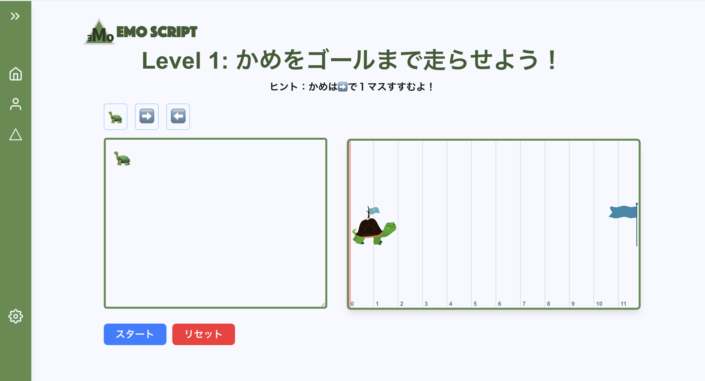
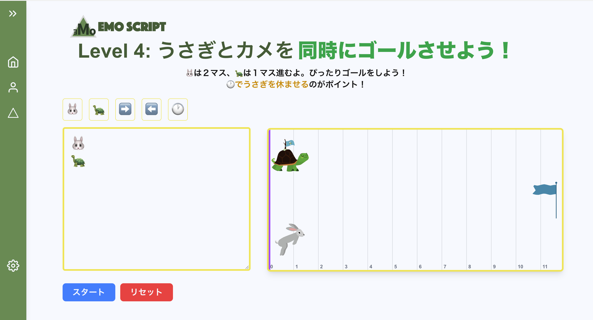

# 🐢 EMo Script - emoji-turtle-next-webapp

> **プログラミングの“はじめの一歩”を、絵文字で。**

---
## 🌍 公開URL

アプリケーションは以下のリンクからアクセスできます：

[https://emoscript.com/](https://emoscript.com/)

## 🎯 プロジェクトの目的

**IT・プログラミングの重要性**が日々高まる中、未来を担う子どもたちに「最初の一歩」を届けることを目指して本プロジェクトを立ち上げました。

**EMo Script（エモ・スクリプト）**は、  
小学生などの**子どもたちが直感的にプログラミングを好きになれる**ように設計された**教育用ゲーム Web アプリ**です。

「🐢 などの動物を絵文字で動かす」 というシンプルで楽しい体験を通じて、
**論理的思考**や**問題解決能力**が自然と身につくことを目指しています。
今後はつるかめ算など小学生が学んでいる内容とリンクさせる予定。

---

## ✨ UI / デザインへのこだわり

- 子どもにも親しみやすくするために、外部サービスを用いて**アニメーションを多用**
- 感じをあまり使わないなど、文字の読みやすさ・色のコントラスト・操作性にも配慮
- 迷わず使えるように、**ナビゲーションをシンプル化**

---

## 🔓 フリープランと今後の展望

- レベル 1〜4 までは体験用 **無料** でプレイ可能
- 今後は **レベル 5 以降の有料プラン** を実装予定
- 課金システムを導入する場合でも、**子どもが安心して使える UI とガイド設計**を重視

> ※広告によるマネタイズも検討中ですが、ペルソナが「子ども」であることから**安全性と倫理性を最優先**しています。

---

## 🔮 今後追加予定の機能

- ✅ 有料プランの導入（進捗保存・カスタムステージなど）
- ✅ ユーザー登録（ログイン・ログアウト）
- ✅ プロフィール設定
- ✅ 複数言語対応（🇯🇵 日本語 / 🇺🇸 英語 など）
- ✅ 教育機関向けモード（先生用ダッシュボード）

---

## 🛠️ 使用技術（Tech Stack）

| 技術          | 内容             |
| ------------- | ---------------- |
| Next.js       | フレームワーク   |
| React         | UI 構築          |
| Framer Motion | アニメーション   |
| Lottie        | アニメーション   |
| Tailwind CSS  | スタイリング     |
| TypeScript    | ロジック処理全般 |
| Vercel        | ホスティング     |

---
## 📸 スクリーンショット
### Level1


---
### Level4


---

## 📄 ライセンス

このプロジェクトは、MITライセンスの下で公開されています。

詳細は、[MIT LICENSE](LICENSE.txt) ファイルを参照してください。

---

## 🚀 ローカルでの実行方法

このプロジェクトをローカルで実行するには、以下の手順を実行してください。

```bash
git clone https://github.com/meso1007/NEXT-emoji-pathgame-webapp
cd emoji-turtle-next-webapp
npm install  # 必要な依存関係をインストール
npm run dev  # 開発サーバーを起動

